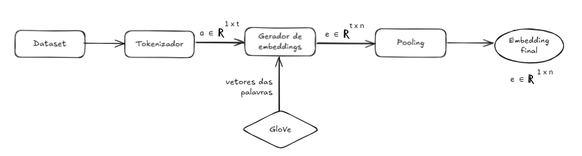
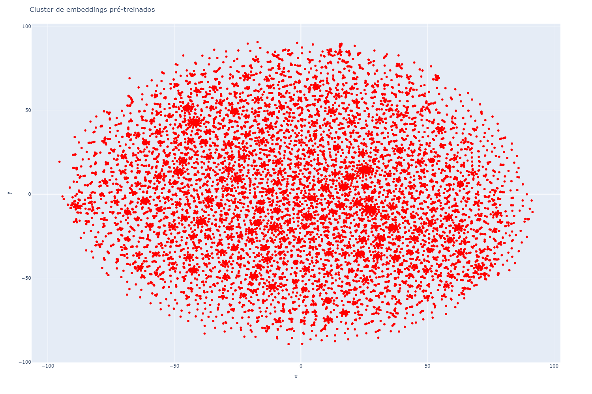
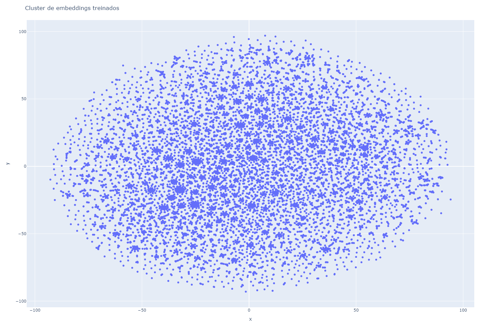
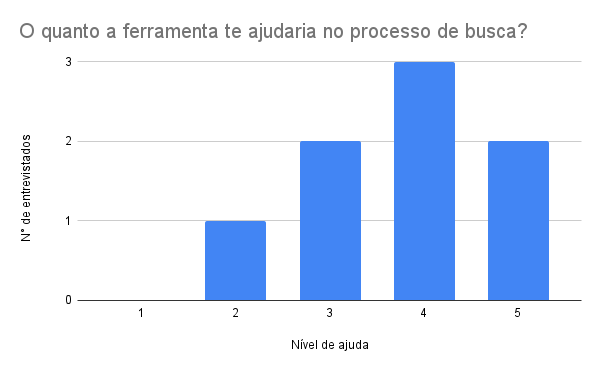

# abstractVectorSearch
Para aprender de maneira mais aprofundada sobre determinado assunto é comum que se procure artigos acadêmicos sobre o mesmo. O AbstractVectorSearch surge da importância de obter mais de uma fonte de referência ao pesquisar sobre determinado tópico, posto que para se ter uma pesquisa rica é essencial que se estude diferentes perspectivas do assunto. 

Nesse contexto, esse projeto tem como objetivo de buscar artigos com temas semelhantes a determinada entrada de um usuário.

## 1. Introdução

### 1.1 Dataset
O dataset utilizado é composto por cerca de 20.000 artigos publicados no arXiv de 2015 a 2024. O [ArXiv](https://arxiv.org/) é um arquivo open-sorce de artigos em diferentes áreas, como física, matemática, ciência da computação, finanças, economia, entre outras. Os artigos desse projeto foram retirados do [arXiv Dataset](https://www.kaggle.com/datasets/Cornell-University/arxiv) presente no Kaggle.

### 1.2 Embeddings
Para realizar a busca desses artigos com um tema similar da entrada provida pelo usuário foi optado por gerar embeddings dos resumos dos artigos. Esses embeddings foram gerados com a partir dos embeddings pré-treinados do [GloVe](https://aclanthology.org/D14-1162/). O processo consistiu nos seguintes passos:
1. O resumo foi tokenizado baseado no vocabulário do GloVe de modo que cada palavra foi transformada em um número;
2. Os tokens foram transformados em uma matriz com os embeddings do GloVe, na qual cada linha representava uma palavra do resumo;
3. Essa matriz passou por um processo no qual foi feita uma média sendo que apenas as palavras que estavam no vocabulário do GloVe foram consideradas na conta. Assim, gerando um único vetor do resumo do artigo.

Na imagem abaixo, $t$ representa o tamanho do texto e $n$ o tamanho do embedding do GloVe, eles assumem os valores de 800 e 300, respectivamente.

    

### 1.3 Treinamento
Além disso, esses embeddings foram treinados para que se ajustassem ao contexto do dataset. O treinamento consistiu em reduzir a dimensão do vetor de $1 \times 300$ para $1 \times 200$, para, então, tentar recuperar as suas informações, ao redimensionar a matriz para o seu formato original ($1 \times 300$). Esse processo foi realizado em 50 épocas, sendo que em cada uma o dataset foi dividido em batches de 64 artigos. O método utilizado foi o gradiente decendente com a intenção de minimizar o erro entre a matriz de entrada e a de saída. A função de erro utilizada foi o Erro Quadrático Médio, que pode ser descrita da seguinte forma.

$$
\ell(x, y) = mean(L)  ,\quad L = \{l_1,\dots,l_N\}^\top, \quad l_n = \left( x_n - y_n \right)^2
$$

Sendo $N$, o tamanho do batch.

## 2. Visualização
Para visualizar os embeddings tanto pré-treinamento, quanto pós-treinamento, foi utilizada a ferramenta TSNE. Ao observar as imagens, é possível notar que o formato geral dos artigos segue a mesma forma oval em ambas. Porém, os pequenos cluster formados em cada uma delas estão posicionados em lugares diferentes. 

    
    

## 3. Sistema de busca
O sistema de busca consiste em passar a entrada do usuário pelo processo de embeddings e usar o resultado para calcular a semelhança da entrada com cada um dos resumos dos artigos. Essa semelhança é calculada através do método do produto interno. Assim, são retornadas apenas os artigos com maior nível de semelhança.

### 3.1 Testes
Os resultados dos testes pode ser visto no [vector_search.ipynb](vector_search.ipynb). 

#### 3.1.1 Teste com 10 resultados
Entrada: `neural network`

Comentário: Apesar de todos os resultados falarem sobre redes, parte fala sobre redes neurais e outra parte fala de redes em geral. 

#### 3.1.2 Teste com menos de 10 resultados
Entrada: `relational database`

Comentário: Os resultados comentavam sobre databases, mas o foco dos artigos não eram as base de dados.

#### 3.1.3 Teste não óbvio
Entrada: `natural language processing`

Comentário: Os resultados variaram entre processamento de dados e estudo matemático.

### 3.2 Conclusão dos testes
Os resultados abrangem artigos relacionados as palavras da busca individualmente. Por isso, nos resultados pode-se ver resultados que cobrem tanto o todo da entrada, quanto apenas uma parte dela.

## 4. Validação da dor
Para validar a dor, foram feitas entrevistas com 8 alunos que já realizaram ou estão realizando iniciação científica, TCC e/ou já tiveram experiência de escrever artigos acadêmicos. 

Durante a entrevista, foi solicitado que os entrevistados classificassem o nível de dificuldade ao buscar artigos de referência para o seu trabalho científico entre 1 e 5, sendo 1 nenhuma dificuldade e 5 muita dificuldade. A média dessa classificação foi 3.4, o que se inferir que para eles não é uma grande dor, mas também causa certo incomodo.

Ao apresentar a ideia de uma ferramenta que auxilia o usuário a encontrar artigos semelhantes a partir de um resumo de seu estudo ou, por exemplo, de outro artigo que o interessou, foi questionado se a ferramenta ajudaria no processo, novamente com uma escala de 1 a 5, no qual 1 seria não ajudaria, posto que as ferramentas já existente são o suficiente e 5 ajudaria muito. As respostas tenderam mais para o lado de que auxiliaria o processo, como pode ser visto na imagem abaixo.

    

Ainda sobre a ferramenta, ao perguntar o impacto que essa teria para os usuários, foi obtido como resposta que seria teria um impacto positivo por trazer mais praticidade e eficiência, além de que aceleraria as buscas.

Com isso, foi possível concluir que apesar da dor não ser crítica, ela existe, e a ferramenta contribuiria para a sua solução, pois tem o potencial de facilitar a busca para os estudantes que estão dentro do quadro especificado no início.

Por fim, foram sugeridas as seguintes características que os entrevistados gostariam que tivessem na ferramenta:
* Apresentar pontos de semelhança e de diferença entre o resumo do artigo de entrada e o resultado;
* Filtros bem detalhados como: data de publicação, tipo de estudo, idioma, nível de rlevância e palavras-chaves;
* Interface clara e objetiva;
* Visualização de grafo dos artigos;
* Base de dados com artigos de diferentes idiomas (além do inglês, que é o único presente na base utilizada pelo projeto até o momento).

